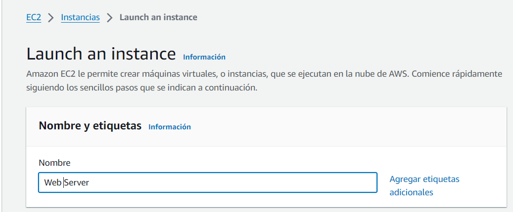
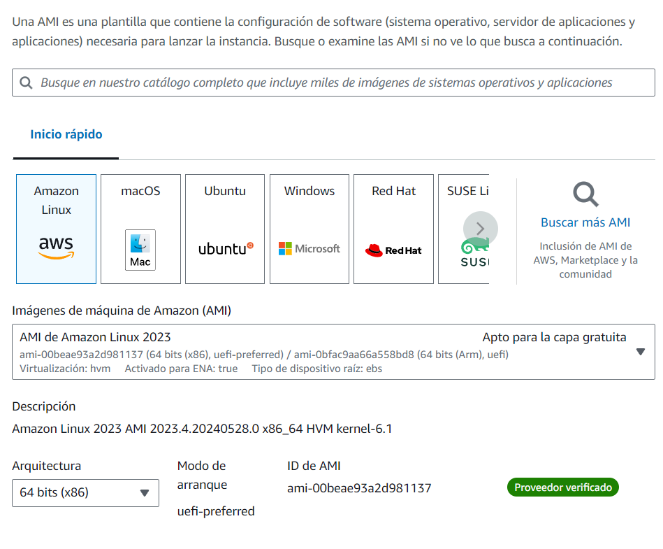

# Laboratorio 6 - ASOCIAR UN VOLUMEN DE EBS
### Evidencias del laboratorio elaborado

## **1.- Crear una instancia y asignarle un nombre**
En este primer paso, crearemos una instancia EC2, a la cual asignaremos el nombre de "WebServer"

## **1.- Seleccionamos el AMI para la instancia**
Ahora, tenemos que seleccionar una AMI a partir de la cual crearemos una instancia. En este caso, mantendremos la opcion seleccionada por defecto. Recordemos que la AMI se encarga de seleccionar el sistema operativo sobre el cual se ejecutará nuestra instancia.

