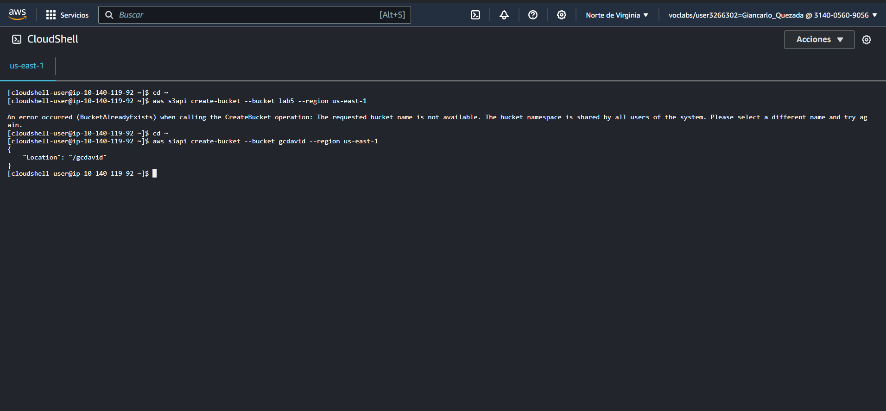

# LABORATORIO N°5
### EVIDENCIAS del laboratorio elaborado

## **CREAR UN BUCKET DE S3 MEDIANTE AWS CLI

1.- Abrimos CloudShell y creamos un nuevo bucket con el nombre definido por nosotros mediante la linea de comandos:

