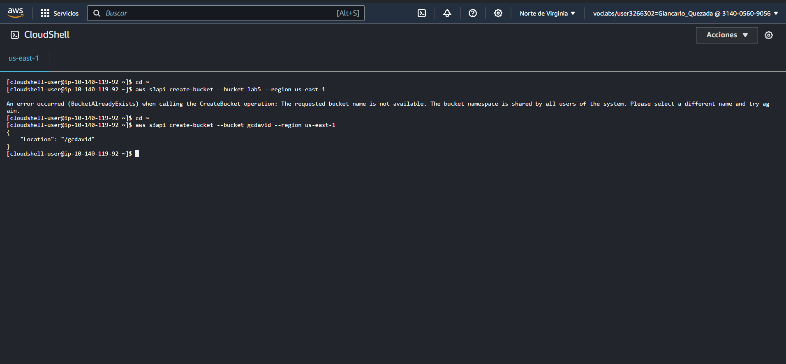
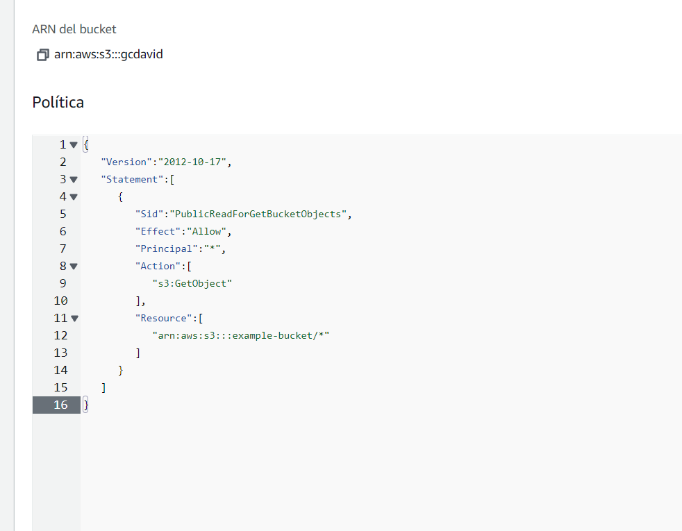
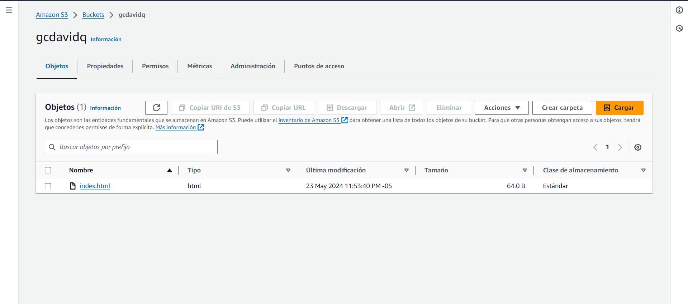
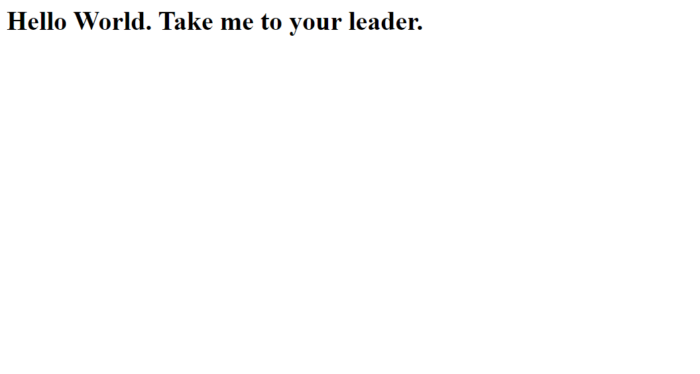
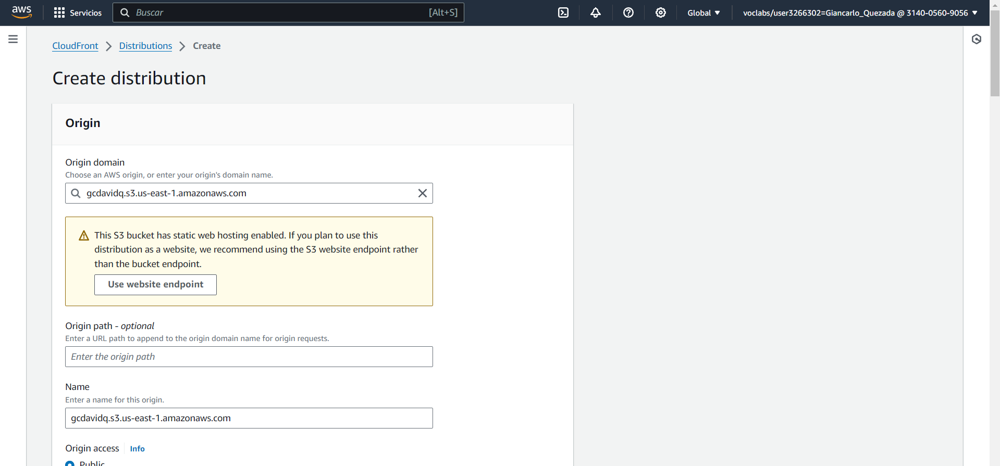
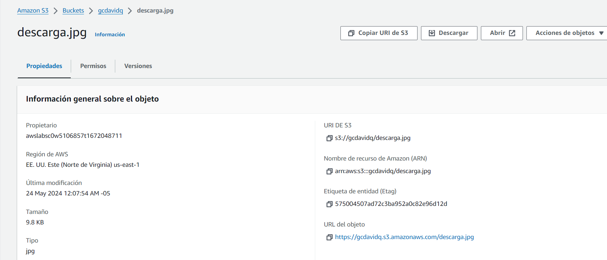
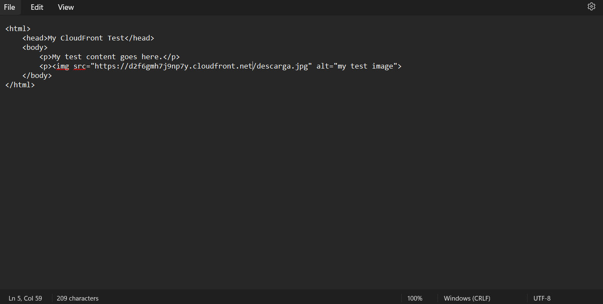
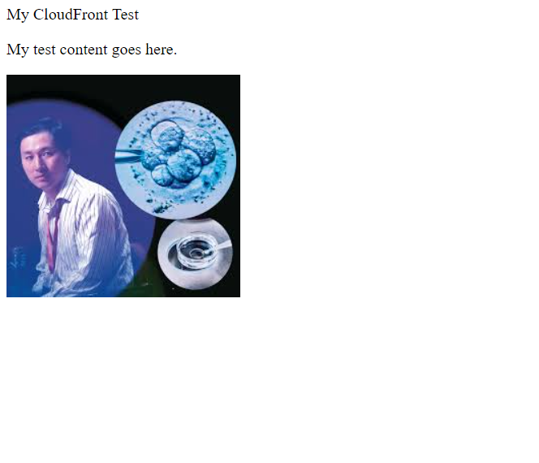

# LABORATORIO N°5
### Evidencias del laboratorio elaborado

##  **1.- CREAR UN BUCKET DE S3 MEDIANTE AWS CLI

1.- Abrimos CloudShell y creamos un nuevo bucket con el nombre definido por nosotros mediante la linea de comandos:

## **2.-Añadir una politica de Bucker**

Añadiremos una politica de bucket mediante el CLI para que el contenido que agregemos dentro de este bucket esté disponible publicamente. 

- Para conceder acceso de lectura publica del sitio web que crearemos, necesitamos agregar la siguiente politica en el editor de polticas del bucket

## **3.- Subir documentos HTML**
En esta sección, subiremos un archivo html como muestra de una pagina web estatica al bucket que acabamos de crear.

## **4.- Probar el sitio web estatico**

Luego de haber subido el sitio web al socket creado en S3, debemos de probarlo, para ello habilitaremos la opcion de Alojamiento de sitios web estaticos en la pestaña propiedades del socket.

Ahora, copiaremos el link que nos aparece y lo pegaremos en otra pestaña, nos debe aparecer la frase "Hola mundo"

## **5.- Crear una distribución de cloudfront para servir al sitio web

Lo que ahora haremos es crear una distribucion de Amazon CloundFrount que servirá al sitio web, lo cual nos permitirá hacer entrada del contenido con baja latencia y alta velocidad.

Luego, crearemos un nuevo archivo HTML al que subiremos una imagen para probar la distribución. En este paso, debemos de subir previamente la imagen al socket de S3 creado y habilitar la visualizacion publica.

Como penultimo paso, crearemos otro archivo HTML en el que se logrará visualizar la imagen subida al bucket. Para ello, previamente debidos de haber copiado el nombre de distribucion de dominio que nos generó cloudfront. El archivo HTML que creemos debe ser similar a este:

Por ultimo, guadaremos el archivo HTML y lo abriremos en nuestro navegador. Si hicimos todos los pasos de manera correcta, nos debe aparecer algo similar a esto:

